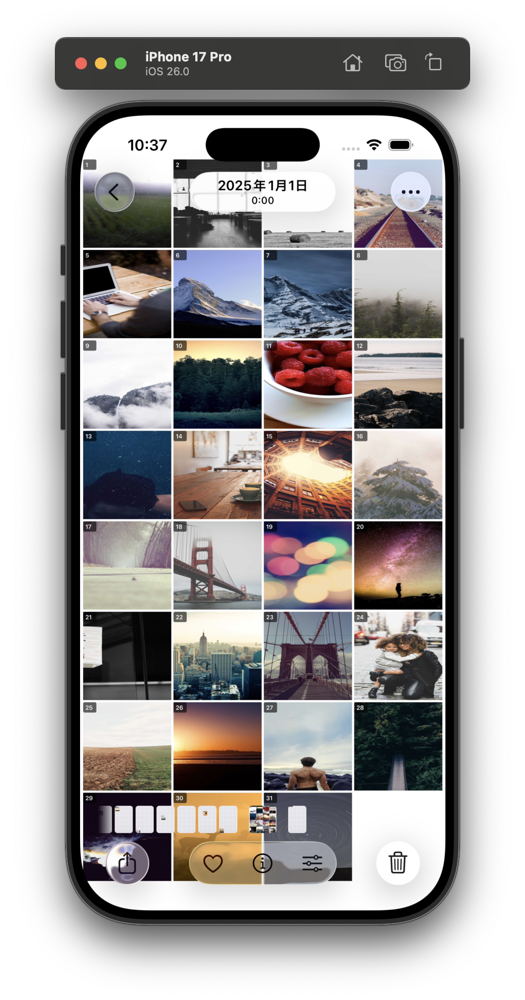

# Photo Cleaner

Amazon Photosにバックアップ済みの古い写真をiPhoneから削除し、ストレージを解放するiOSアプリ。

## スクリーンショット

<p align="center">
  
  
  
  
</p>
<p align="center">
  <em>メイン画面</em>&nbsp;&nbsp;&nbsp;&nbsp;&nbsp;&nbsp;&nbsp;&nbsp;&nbsp;&nbsp;&nbsp;&nbsp;&nbsp;&nbsp;
  <em>設定</em>&nbsp;&nbsp;&nbsp;&nbsp;&nbsp;&nbsp;&nbsp;&nbsp;&nbsp;&nbsp;&nbsp;&nbsp;&nbsp;&nbsp;&nbsp;&nbsp;&nbsp;&nbsp;&nbsp;
  <em>削除確認</em>&nbsp;&nbsp;&nbsp;&nbsp;&nbsp;&nbsp;&nbsp;&nbsp;&nbsp;&nbsp;&nbsp;&nbsp;
  <em>コンタクトシート</em>
</p>

## なぜこのアプリが必要か

iPhoneのストレージは限られています。Amazon Photosなどのクラウドサービスに写真をバックアップしても、iPhone本体の写真は自動で削除されません。

このアプリは「バックアップ済みの古い写真」を一括削除することで、iPhoneのストレージを解放します。

削除前に月ごとの写真を1枚の画像にまとめて保存するため、いつでも振り返ることができます。

## 機能

- 指定日数（デフォルト: 2年）以上前の写真を削除
- お気に入りの写真は自動的に保護
- 保護するアルバムを選択可能（デフォルト: Keep）
- 削除前に「月ごとの思い出」を1枚の画像にまとめて保存
- 動画は削除対象外（写真のみ）

## 必要条件

- Xcode 15以上
- iOS 17以上
- Apple Developer Account（無料アカウントでも可）

## セットアップ

### 1. クローンとセットアップ

```bash
git clone https://github.com/azu/photo-cleaner.git
cd photo-cleaner
./setup.sh
```

### 2. Team IDを設定

`LocalConfig.xcconfig` を編集:

```
DEVELOPMENT_TEAM = YOUR_TEAM_ID_HERE
```

Team IDは [Apple Developer Account](https://developer.apple.com/account) → Membership で確認できます。

### 3. Xcodeでビルド

```bash
open PhotoCleaner.xcodeproj
```

⌘R でビルド・実行

## 使い方

1. アプリ起動 → フォトライブラリへのアクセスを許可
2. 自動スキャンで削除対象の写真数と解放されるストレージを確認
3. 設定（右上の歯車）で調整:
   - バックアップ猶予日数
   - 保護するアルバム
   - コンタクトシート生成の有無
4. 「削除を実行する」をタップ
5. システム確認ダイアログで承認

削除された写真は「最近削除した項目」に30日間保持されます。

## 設定項目

| 項目 | 説明 | デフォルト |
|------|------|-----------|
| バックアップ猶予日数 | この日数より古い写真が削除対象 | 730日（2年） |
| 保護するアルバム | 選択したアルバム内の写真は削除されない | Keep |
| コンタクトシート生成 | 削除前に月ごとのコンタクトシートを生成 | ON |
| 保存先アルバム | コンタクトシートの保存先 | Keep |

## 保護される写真

以下の写真は削除対象から除外されます:

- お気に入りに設定した写真
- 保護対象アルバム内の写真
- 動画ファイル

## コンタクトシートについて

削除する前に、その月の写真を1枚の画像にまとめて保存します。

- 1日1枚、その日を代表する写真を自動選択
- 1ヶ月分を1枚の画像（コンタクトシート）として保存
- 保存先は指定したアルバム（デフォルト: Keep）

## トラブルシューティング

### ビルドエラー: Signing requires a development team

Xcodeでxcconfigが設定されていません:

1. プロジェクト設定 → Info タブ
2. Configurations セクション
3. Debug / Release 両方で `LocalConfig` を選択

### フォトライブラリへのアクセスが拒否される

設定アプリ → Photo Cleaner → 写真 → 「フルアクセス」を選択

## License

MIT
